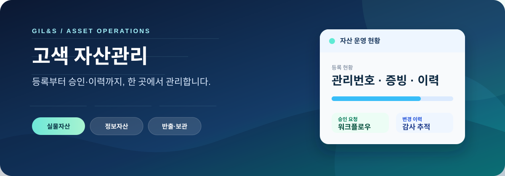

<p align="center">
  
</p>

<p align="center">
  Google Apps Script 기반의 자산 등록·조회·승인 관리 도구입니다.<br>
  <a href="https://script.google.com/macros/s/AKfycbxubcW2BW4tKQjFl5PJ0cbtTf7niLVlfr54hcwAx3ozkUQ8bEo3_SU7jlhfyOXV4ZXS/exec"><strong>웹앱 열기</strong></a>
  &nbsp;·&nbsp;
  <a href="docs/운영_절차서.md">운영 절차</a>
  &nbsp;·&nbsp;
  <a href="docs/등록_체크시트.md">등록 체크시트</a>
</p>

## 무엇을 하나요

| 영역 | 제공 기능 |
| --- | --- |
| 실물자산 | 등록·조회·수정 요청, 관리번호 발급, 사진·증빙 연결 |
| 정보자산 | 사업장별 대장 선택과 자산 검색·관리 |
| 반출·보관 | 신청, 승인, 반려, 상태 이력 관리 |
| 방문·출입 | 방문 신청, 승인, QR 기반 출입 처리 |
| 운영 관리 | 역할별 메뉴, 내부 알림, 감사 로그, 관리 요청 |

## 구성

```text
google_apps_script/  Apps Script 서버와 웹 화면
tests/               정적·모의 검증
docs/                운영 절차, 체크시트, 공개 보고서
```

`google_apps_script/Code.gs`가 서버 로직과 URL 라우팅을 담당하고, 각 HTML 파일은 역할·업무별 화면입니다. 로컬 배포 설정, 점검 증빙, 임시 산출물은 Git 추적에서 제외합니다.

## 자산 사진 구조

```text
비품 사진/
└─ 관리번호_구입처_품목/
   ├─ 송장/
   ├─ 발주서/
   ├─ 세금계산서/
   └─ 실물 사진/
```

사진은 다음 이름 규칙으로 저장합니다.

```text
관리번호_품목_송장_01.jpg
관리번호_품목_발주서_01.jpg
관리번호_품목_세금계산서_01.jpg
관리번호_품목_01.jpg
관리번호_품목_02.jpg
관리번호_품목_03.jpg
```

## 운영 원칙

- 사람 사용자는 자산대장·로그를 직접 수정하지 않고 웹앱을 사용합니다.
- 변경 로그는 기존 행을 수정하지 않고 새 행으로 남깁니다.
- 신규 등록용 촬영 자료는 `촬영사진 임시보관`에 최대 4시간만 보관한 뒤, 등록 완료 시 자산 폴더로 이동합니다.
- 기존 사진 폴더와 원본 데이터는 등록 과정에서 임의로 수정하지 않습니다.

## 배포와 검증

1. Apps Script 프로젝트에 `google_apps_script/`의 소스를 동기화합니다.
2. `setupAssetManagementSystem_()`을 실행해 초기 연결을 확인합니다.
3. 소유자 권한으로 웹앱을 배포합니다.
4. `tests/`의 정적·모의 검증을 실행하고, 실제 브라우저·모바일 흐름은 별도로 확인합니다.

정적 검증 통과만으로 운영 배포나 모바일 동작 완료를 판단하지 않습니다.
